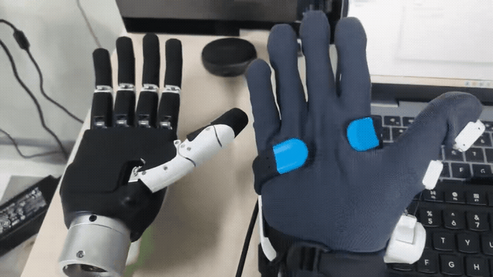

# Nova2Dex

**Nova2Dex：面向灵巧手遥操作的 ROS 2 框架**

## 遥操作演示



Nova2Dex 通过 ROS 2 Humble 数据管线，将 SenseGlove Nova 2 手部追踪数据连接至受支持的机器人灵巧手。本仓库包含 Windows 端 Nova 2 读取器、UDP 到 ROS 桥接器、可复用的 ROS 消息接口、动作重定向模块、仿真查看器、硬件驱动以及 Unitree DDS 桥接器。

目前代码支持 BrainCo Revo2 和六通道 Inspire 灵巧手。历史名称 `ManusGlove` 和 `manus_revo2_retarget` 作为稳定内部接口予以保留；本仓库不包含 MANUS 和 Hex 手套驱动。

## 项目概述

Nova 2 通过 Windows 上的 SenseCom 和 SenseGlove SDK 读取。读取器每帧向 Ubuntu ROS 2 主机发送一个 UDP v3 JSON 数据报。ROS 桥接器发布与 `ManusGlove` 兼容的消息，这些消息可以进入 Revo2 或 Inspire 动作重定向链路。

支持 `left`、`right` 和 `both` 三种手型模式。本仓库记录的真实硬件验证覆盖右手 Nova 2 通过 Unitree DDS 控制 BrainCo Revo2 的链路。其他组合在使用前也应在目标硬件上完成验证。

## 主要功能

- 通过 Windows UDP v3 读取器接入 SenseGlove Nova 2。
- 支持左手、右手和双手 ROS 2 数据路由。
- 支持按通道配置输入缩放、方向、偏移和限位。
- 提供三类 Revo2 重定向算法：Dex、Revo3 风格拇指 IK 和关节语义直映射。
- 为六通道 Inspire 灵巧手提供基于归一化屈曲度的直接映射。
- 提供支持 Modbus 和可选 CAN FD 的 BrainCo Revo2 `ros2_control` 驱动。
- 提供适用于 G1 搭载 BrainCo Revo2 和 Inspire 灵巧手的 Unitree DDS 桥接器。
- 提供 Revo2 URDF/RViz 资源以及 Revo2、Inspire MuJoCo 查看器。
- 提供映射/转换自检程序和硬件验证命令。

## 系统架构

```text
Windows                                       Ubuntu 22.04 / ROS 2 Humble

Nova 2 -> SenseCom -> SenseGlove SDK -> UDP v3 JSON
                                             |
                                             v
                                    nova2_glove_driver
                                             |
                                  /manus_glove_0 和 _1
                                      /              \
                                     v                v
                          Revo2 动作重定向       Inspire 直接映射
                           /          \             /          \
                          v            v           v            v
                    ros2_control   Unitree DDS   MuJoCo     Unitree DDS
                    Modbus/CAN FD       |                         |
                          |             v                         v
                     Revo2 灵巧手   G1 Revo2 服务          G1 Inspire 服务
```

## 仓库结构

```text
.
├── assets/                         # 用户提供的图片和视频
├── src/
│   ├── input/
│   │   └── nova2_glove_driver/     # UDP JSON -> ManusGlove 兼容 ROS 数据
│   ├── interfaces/
│   │   └── manus_ros2_msgs/        # 共用 ROS 2 消息
│   ├── retargeting/
│   │   ├── manus_revo2_retarget/   # Revo2 算法和查看器
│   │   └── nova2_inspire_retarget/ # Inspire 直接映射和查看器
│   └── hardware/
│       ├── brainco/                # Revo2 描述、驱动和 DDS 桥
│       └── inspire/                # Inspire DDS 桥和 G1 串口服务
├── windows/
│   └── nova2_bridge/               # Windows Qt/SenseGlove UDP 读取器源码
├── requirements.txt
└── test.md                         # 测试和验证命令参考
```

每个 ROS 2 软件包均保留原生的 `package.xml`、构建文件以及 `launch/`、`config/`、`src/`、`include/` 布局。Colcon 会递归发现软件包，因此功能分组不会改变软件包名称或 ROS 接口。

## 环境要求

基础环境：

- Ubuntu 22.04
- ROS 2 Humble
- Python 3
- 支持 C++17 的编译器和 colcon
- `requirements.txt` 中列出的 Python 软件包

## 安装

```bash
git clone <your-fork-or-repository-url> Nova2Dex
cd Nova2Dex

source /opt/ros/humble/setup.bash
python3 -m pip install -r requirements.txt

rosdep install --from-paths src --ignore-src -r -y
colcon build --symlink-install --cmake-args -DBUILD_TESTING=OFF
source install/setup.bash
```

保留的 `download_sdk.sh` 可以在需要时更新或修复固定版本的 BrainCo SDK。完整构建还需要可选的 Unitree SDK 依赖。若只需要 Nova 2 和 Inspire 仿真链路，可先构建以下软件包：

```bash
colcon build --symlink-install --packages-select \
  manus_ros2_msgs nova2_glove_driver nova2_inspire_retarget
source install/setup.bash
```

## 快速开始

首先按照 [Nova 2 Windows 读取器指南](windows/nova2_bridge/README_CN.md)构建 Windows 读取器，并将其配置为向 Ubuntu 主机发送数据。

### Nova 2 到 Revo2 仿真

```bash
source /opt/ros/humble/setup.bash
source install/setup.bash

ros2 launch nova2_glove_driver nova2_glove_pipeline.launch.py \
  hand_mode:=right \
  enable_left:=false \
  enable_right:=true \
  if_sim:=true \
  udp_port:=15020 \
  launch_plot:=false
```

### Nova 2 到 Inspire 灵巧手仿真

```bash
ros2 launch nova2_inspire_retarget sim_pipeline.launch.py \
  hand_mode:=right \
  udp_port:=15020 \
  launch_viewer:=true
```

## 使用方法

请先使用仿真确认话题频率、运动方向和范围，再启用真实灵巧手。完整的测试与验证命令见 [test.md](test.md)，各模块的详细运行参数见对应软件包目录下的 README。

默认输入话题：

```text
/manus_glove_0    左手
/manus_glove_1    右手
```

UDP 超时后，桥接器会停止发布新的手套消息，而不会发布虚构的张开手型。

## 测试

构建检查、单元测试/自检命令、ROS 话题检查、仿真验证和保守的真实硬件检查方法，请参阅 [test.md](test.md)。

## 演示

### 仿真演示

<!-- 在此添加仿真截图或 GIF。 -->

### 真实硬件演示

<!-- 在此添加真实硬件演示 GIF 或视频预览。 -->

后续媒体文件可存放在 `assets/images/` 和 `assets/videos/`。较大的视频建议托管在外部，并在仓库中提交预览图。

## 许可证

本项目以 [MIT 许可证](LICENSE)发布。

## 致谢

- 感谢 SenseGlove 提供 Nova 2 和 SenseGlove SDK。
- 感谢 BrainCo 提供 Revo2 灵巧手和 Stark SDK。
- 感谢因时机器人提供受支持的 Inspire 灵巧手接口。
- 感谢 Unitree 提供 G1 和 `unitree_sdk2`。
- 感谢 AnyDexRetarget 贡献者提供已注明来源的 Inspire 模型资源。
- 感谢 MuJoCo 和 ROS 2 社区贡献者。
